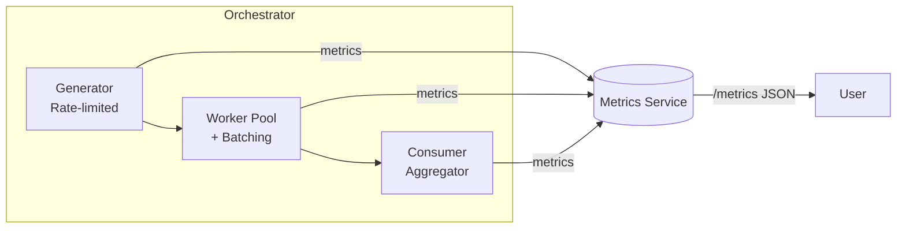

# 🚀 Log Processing Pipeline (Golang)

A concurrent **log processing pipeline** written in Go, demonstrating **channels**, **context cancellation**, **rate limiting**, **batching**, **worker pools**, and **real-time metrics** — all orchestrated cleanly for multiple independent pipelines.

---

## 🧩 Overview

This project simulates a real-time log stream processing system where:
1. Logs are **generated** at a configurable rate.
2. A **worker pool** batches and processes logs concurrently.
3. A **consumer** aggregates and displays processed results.
4. A **metrics HTTP server** exposes live counters for all running pipelines.

Each pipeline (like “access” or “error”) runs independently with its own:
- Channels  
- Workers  
- Rate limits  
- Batching behavior  
- Metrics counters  

---

## ⚙️ Features

| Feature | Description |
|----------|-------------|
| **Rate Limiting** | Controlled log generation using a `time.Ticker` (e.g. 5 logs/sec). |
| **Batching** | Workerpool collects logs into batches of N or flushes after timeout. |
| **Worker Pool** | Concurrent processing of logs using bounded goroutines. |
| **Context-Aware Cancellation** | Graceful shutdown on Ctrl+C or timeout. |
| **Atomic Metrics** | Thread-safe metrics per pipeline (`generated`, `processed`, `batches`, `aggregated`). |
| **HTTP Metrics Endpoint** | `/metrics` endpoint returns live JSON metrics for all pipelines. |
| **Multi-Pipeline Support** | Multiple log streams (like `access`, `error`) can run in parallel. |

---

## 🧠 Architecture



Each pipeline’s flow is isolated, coordinated by the **Orchestrator**.

---

## 🏗️ Project Structure

```
.
├── cmd/
│   └── main.go                    # Entry point (starts orchestrator)
├── internal/
│   ├── consumer/                  # Aggregator logic
│   ├── generator/                 # Log generator with rate limiting
│   ├── metrics/                   # Atomic metrics counters + /metrics HTTP server
│   ├── orchestrator/              # Runs multiple pipelines concurrently
│   ├── pipeline/                  # Shared data model (Log struct)
│   └── workerpool/                # Batched worker pool with concurrency control
└── go.mod
```

---

## 🏃‍♂️ Running the Project

### 1️⃣ Clone and setup
```bash
git clone https://github.com/abh1shekyadav/log-processing-pipeline.git
cd log-processing-pipeline
go mod tidy
```

### 2️⃣ Run
```bash
go run ./cmd
```

You’ll see real-time log generation and processing:

```
[MAIN] Starting LogStream (final phase)
[access] starting
[error] starting
[AGGREGATOR] [processed] Log message #1 at 12:05:33
[AGGREGATOR] [processed] Log message #2 at 12:05:34
...
```

Press **Ctrl + C** to trigger a graceful shutdown.

---

## 📊 Viewing Metrics

A lightweight metrics server runs automatically on port `9090`.

Visit:

👉 **http://localhost:9090/metrics**

You’ll get JSON like:

```json
{
  "access": {
    "name": "access",
    "uptime_sec": 15.02,
    "generated": 60,
    "processed": 60,
    "batches": 8,
    "aggregated": 60
  },
  "error": {
    "name": "error",
    "uptime_sec": 15.01,
    "generated": 30,
    "processed": 30,
    "batches": 8,
    "aggregated": 30
  }
}
```

---

## ⚙️ Configuration (via `cmd/main.go`)

You can tweak parameters per pipeline:
```go
configs := []orchestrator.PipelineConfig{
  {
    Name:       "access",
    NumWorkers: 3,
    GenCount:   60,
    GenRate:    5,              // logs per second
    BatchSize:  8,              // max logs per batch
    BatchWait:  2 * time.Second // flush timeout
  },
  {
    Name:       "error",
    NumWorkers: 2,
    GenCount:   30,
    GenRate:    2,
    BatchSize:  4,
    BatchWait:  3 * time.Second
  },
}
```

---

## 🧪 Concepts Demonstrated

| Concept | Example |
|----------|----------|
| Goroutines | Each stage (generator, workerpool, consumer) runs concurrently |
| Channels | Safe inter-stage communication (`jobs`, `results`) |
| Context | Graceful shutdowns on signal |
| Rate Limiting | `time.Ticker` pacing |
| Batching | Accumulate and flush logs |
| Worker Pool | Fixed concurrency with semaphore pattern |
| Metrics | Atomic counters + lightweight /metrics endpoint |
| Fan-Out/Fan-In | Multiple pipelines running in parallel, all reporting to metrics |

---

## 🧩 Example Output

```
[MAIN] Starting LogStream (final phase)
[access] starting
[error] starting
[AGGREGATOR] [processed] Log message #1 at 12:08:13
[AGGREGATOR] [processed] Log message #2 at 12:08:13
[access] generator finished
[access] workerpool finished
[access] aggregator finished; pipeline complete
[MAIN] orchestrator finished successfully
```

---

## 🏁 License

MIT License.  
